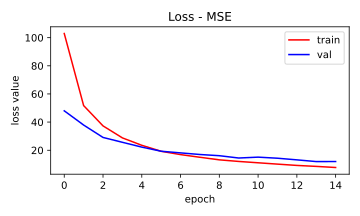
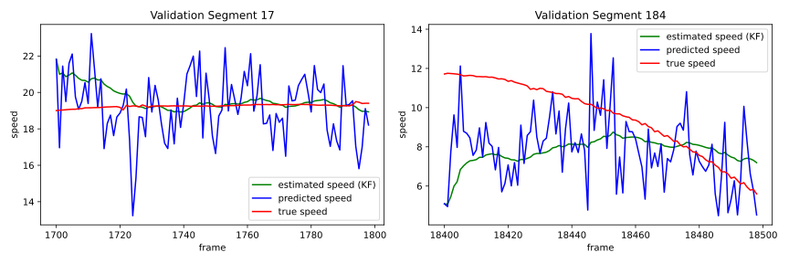

# Speed Challenge

[0]: https://chatbotslife.com/autonomous-vehicle-speed-estimation-from-dashboard-cam-ca96c24120e4
[1]: https://arxiv.org/abs/1604.07316

Estimating vehicle speed using an onboard camera.

I followed the suggestions in [Autonomous Vehicle Speed Estimation from Dashboard Cam][0]
blogpost and used __dense optical flow__ from two consecutive images with a
__convolutional network__. The network architecture is borrowed from NVIDIA
paper [End to End Learning for Self-Driving Cars][1].

Furthermore, I tried to improve the results by using __Kalman Filter__ to
smooth the speed predicted by the network. The filter is using a simple state
model `x_k+1 = x_k + w_k` where `x_k` is the speed at `k`-th time step and
`w_k` is the process noise.

## Results

|                | Network | Network + KF |
|----------------|---------|--------------|
| Validation MSE | 11.98   | 7.42         |

The use of Kalman Filter improves the overall mean squared error achieved on
the validation set. As seen in the figure below, the constant state model
works well when the speed does not change but fails when the vehicle starts
to accelerate.

